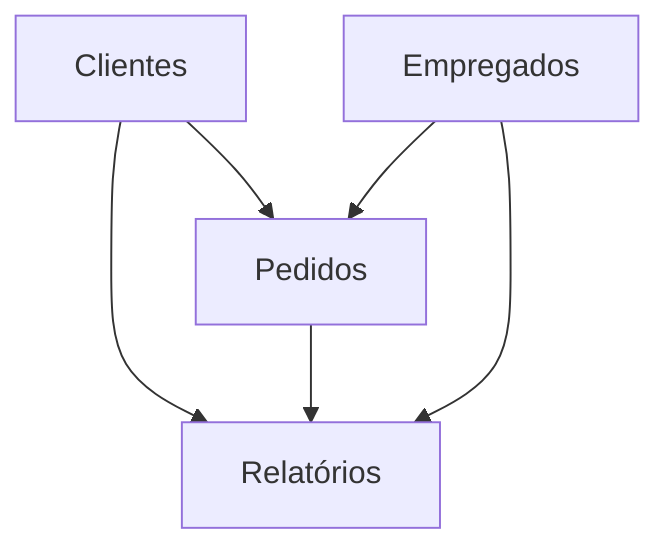

# dbt-core-Northwind-project

Este projeto cria um data warehouse completo utilizando PostgreSQL instanciado na AWS. Usando dbt-core, transformamos dados do Database Northwind para gerar relatórios detalhados. 

O objetivo é demonstrar como construir uma infraestrutura de dados moderna e eficiente, e como usar dbt-core para criar modelos de dados e relatórios.

## Estrutura do Projeto

- **AWS RDS PostgreSQL**: Instância de banco de dados PostgreSQL.
- **dbt-core**: Ferramenta de transformação de dados para criar modelos e gerar relatórios.
- **Northwind Demo Database**: Banco de dados de exemplo utilizado para os dados de entrada.

## Relatórios Gerados

1. **Relatório de Pedidos de 1996 e seus Clientes**:
   - Mostra todos os pedidos feitos em 1996 e os detalhes dos clientes que fizeram esses pedidos.
   
2. **Número de Empregados e Clientes por Cidade com Empregados**:
   - Exibe o número de empregados e clientes em cada cidade que possui empregados.
   
3. **Número de Empregados e Clientes por Cidade com Clientes**:
   - Exibe o número de empregados e clientes em cada cidade que possui clientes.
   
4. **Número de Empregados e Clientes por Cidade**:
   - Exibe o número de empregados e clientes em cada cidade.

## Configuração do Projeto

### Pré-requisitos

- Conta na AWS com permissões para criar instâncias RDS e configurar VPCs.
- Python 3.6 ou superior.
- dbt-core.

### Instalação

1. **Clone o repositório**:
   ```sh
   git clone https://github.com/seu-usuario/northwind-data-warehouse.git
   cd northwind-data-warehouse
   ```

2. **Instale o dbt-core**:
   ```sh
   pip install dbt-core
   ```

3. **Configure a conexão dbt**:
   Crie um arquivo `profiles.yml` na pasta `~/.dbt/` com o seguinte conteúdo:
   ```yaml
   northwind_project:
     outputs:
       dev:
         type: postgres
         host: your-aws-rds-endpoint
         user: your-username
         password: your-password
         dbname: northwind
         schema: public
         port: 5432
     target: dev
   ```

4. **Importe o Northwind Demo Database**:
   - Baixe o script SQL do Northwind Demo Database.
   - Conecte-se ao PostgreSQL usando um cliente SQL (ex: pgAdmin, DBeaver) e execute o script para criar o banco de dados.

### Executando o Projeto

1. **Inicie o projeto dbt**:
   ```sh
   dbt init northwind_project
   ```

2. **Copie os modelos para a pasta `models` do projeto dbt**:
   - models/orders_1996.sql
   - models/employees_customers_by_employee_city.sql
   - models/employees_customers_by_customer_city.sql
   - models/employees_customers_by_city.sql

3. **Execute os modelos dbt**:
   ```sh
   dbt run
   ```

### Estrutura dos Modelos

```sql
-- models/orders_1996.sql
with orders_1996 as (
    select *
    from orders
    where extract(year from order_date) = 1996
)
select 
    o.*, 
    c.customer_name 
from 
    orders_1996 o
join 
    customers c on o.customer_id = c.customer_id
```

```sql
-- models/employees_customers_by_employee_city.sql
with employee_cities as (
    select city, count(*) as employee_count
    from employees
    group by city
),
customer_cities as (
    select city, count(*) as customer_count
    from customers
    group by city
)
select 
    e.city, 
    e.employee_count, 
    coalesce(c.customer_count, 0) as customer_count
from 
    employee_cities e
left join 
    customer_cities c on e.city = c.city
```

```sql
-- models/employees_customers_by_customer_city.sql
with customer_cities as (
    select city, count(*) as customer_count
    from customers
    group by city
),
employee_cities as (
    select city, count(*) as employee_count
    from employees
    group by city
)
select 
    c.city, 
    coalesce(e.employee_count, 0) as employee_count, 
    c.customer_count
from 
    customer_cities c
left join 
    employee_cities e on c.city = e.city
```

```sql
-- models/employees_customers_by_city.sql
with employee_cities as (
    select city, count(*) as employee_count
    from employees
    group by city
),
customer_cities as (
    select city, count(*) as customer_count
    from customers
    group by city
)
select 
    coalesce(e.city, c.city) as city, 
    coalesce(e.employee_count, 0) as employee_count, 
    coalesce(c.customer_count, 0) as customer_count
from 
    employee_cities e
full outer join 
    customer_cities c on e.city = c.city
```

### Estrutura Geral (MermaidJS)



## Contribuição

Contribuições são bem-vindas! Sinta-se à vontade para abrir issues ou pull requests.

## Licença

Este projeto está licenciado sob a Licença MIT. Veja o arquivo LICENSE para mais detalhes.
```

Este `README.md` fornece uma visão geral do projeto, detalha os passos de configuração e execução, e inclui as estruturas dos modelos SQL necessários para gerar os relatórios especificados.