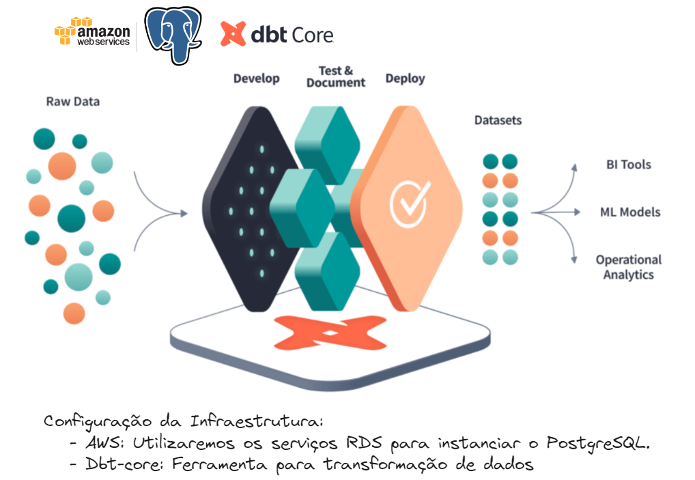
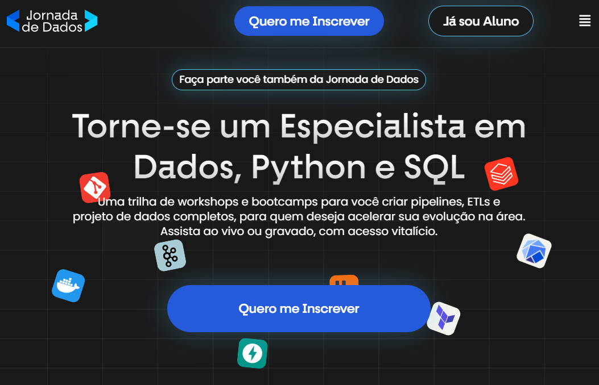

# dbt-core-northwind-project

## Arquitetura moderna utilizando dbt-core e postgres na AWS

Apresentar de forma prática uma solução completa de dados aproveitando os principais módulos e funcionalidades do dbt-core. Toda infra de dados com um Postgres na AWS.



A ferramenta dbt (data build tool) é uma solução inovadora no campo da engenharia de dados, projetada para conectar-se a repositórios de dados centralizados como Data Warehouses e Data Lakes. Ela habilita usuários de negócios, analistas e engenheiros a gerar transformações de dados, regras de negócios e insights valiosos de forma autônoma e eficiente.

## Guia

- Se você é novo com sql, recomendamos que faça até a [aula 05 do bootcamp de SQL](https://github.com/lvgalvao/Northwind-SQL-Analytics/tree/main)
- Se você é novo no dbt-core, recomendo que leia o Guía rápido para criar o seu primeiro modelo

## Jornada de Dados

Esse projeto faz parte da comunidade de estudo Jornada de dados
Nossa missão é **fornecer o melhor ensino em engenharia de dados**



Se você quer:

1) Construir uma **base sólida** em Python e SQL
2) Aprender as **principais habilidades e ferramentas** de engenharia de dados
3) Criar ou melhorar seu **portfólio** de dados
4) Criar ou aumentar o seu **networking** na área
5) Mudar ou dar o **próximo passo em sua carreira**

A **Jornada de Dados** é o seu lugar

## O que é dbt?

O dbt é uma ferramenta focada na transformação de dados dentro de um pipeline de ETL/ELT, onde ETL significa Extrair, Transformar e Carregar. Ele se concentra especificamente no aspecto de Transformação (T), permitindo a criação de fluxos de trabalho de transformação de dados usando SQL.


## Origem e Evolução

Criado em 2016 para endereçar desafios de unidade e orquestração em SQL, o dbt ganhou tração com a popularização de Data Warehouses em cloud como Redshift, BigQuery, Azure Synapse e Snowflake. Seu desenvolvimento foi impulsionado tanto pela equipe original quanto por uma vibrante comunidade de código aberto.

## Princípios Fundamentais do dbt

### SQL para Desenvolvimento Rápido

O dbt utiliza SQL, juntamente com a linguagem de templates Jinja, permitindo a reutilização e modularização do código SQL.

### Controle de Versão e Trabalho Colaborativo

Com integração Git, o dbt facilita a colaboração e o controle de versões, essencial para pipelines de dados robustos e confiáveis.

### Qualidade e Testes

O dbt suporta integração e entrega contínuas, juntamente com testes automatizados, garantindo a integridade e a eficácia das transformações de dados.

### Documentação e Linhagem de Dados

A documentação é gerada automaticamente, proporcionando uma visão clara da linhagem dos dados e facilitando a rastreabilidade e a compreensão das transformações.

## Estrutura do Projeto

- **AWS RDS PostgreSQL**: Instância de banco de dados PostgreSQL.
- **dbt-core**: Ferramenta de transformação de dados para criar modelos e gerar relatórios.
- **Northwind Demo Database**: Banco de dados de exemplo utilizado para os dados de entrada.

## Relatórios Gerados

1. **Relatório de Pedidos de 1996 e seus Clientes**:
   - Mostra todos os pedidos feitos em 1996 e os detalhes dos clientes que fizeram esses pedidos.
   
2. **Número de Empregados e Clientes por Cidade com Empregados**:
   - Exibe o número de empregados e clientes em cada cidade que possui empregados.
   
3. **Número de Empregados e Clientes por Cidade com Clientes**:
   - Exibe o número de empregados e clientes em cada cidade que possui clientes.
   
4. **Número de Empregados e Clientes por Cidade**:
   - Exibe o número de empregados e clientes em cada cidade.

## Configuração do Projeto

### Pré-requisitos

- Conta na AWS com permissões para criar instâncias RDS e configurar VPCs.
- Python 3.6 ou superior.
- dbt-core.

### Instalação

1. **Clone o repositório**:
   ```sh
   git clone https://github.com/seu-usuario/northwind-data-warehouse.git
   cd northwind-data-warehouse
   ```

2. **Instale o dbt-core**:
   ```sh
   pip install dbt-core
   ```

3. **Configure a conexão dbt**:
   Crie um arquivo `profiles.yml` na pasta `~/.dbt/` com o seguinte conteúdo:
   ```yaml
   northwind_project:
     outputs:
       dev:
         type: postgres
         host: your-aws-rds-endpoint
         user: your-username
         password: your-password
         dbname: northwind
         schema: public
         port: 5432
     target: dev
   ```

4. **Importe o Northwind Demo Database**:
   - Baixe o script SQL do Northwind Demo Database.
   - Conecte-se ao PostgreSQL usando um cliente SQL (ex: pgAdmin, DBeaver) e execute o script para criar o banco de dados.

### Executando o Projeto

1. **Inicie o projeto dbt**:
   ```sh
   dbt init northwind_project
   ```

2. **Copie os modelos para a pasta `models` do projeto dbt**:
   - models/orders_1996.sql
   - models/employees_customers_by_employee_city.sql
   - models/employees_customers_by_customer_city.sql
   - models/employees_customers_by_city.sql

3. **Execute os modelos dbt**:
   ```sh
   dbt run
   ```

### Estrutura dos Modelos

```sql
-- models/orders_1996.sql
with orders_1996 as (
    select *
    from orders
    where extract(year from order_date) = 1996
)
select 
    o.*, 
    c.customer_name 
from 
    orders_1996 o
join 
    customers c on o.customer_id = c.customer_id
```

```sql
-- models/employees_customers_by_employee_city.sql
with employee_cities as (
    select city, count(*) as employee_count
    from employees
    group by city
),
customer_cities as (
    select city, count(*) as customer_count
    from customers
    group by city
)
select 
    e.city, 
    e.employee_count, 
    coalesce(c.customer_count, 0) as customer_count
from 
    employee_cities e
left join 
    customer_cities c on e.city = c.city
```

```sql
-- models/employees_customers_by_customer_city.sql
with customer_cities as (
    select city, count(*) as customer_count
    from customers
    group by city
),
employee_cities as (
    select city, count(*) as employee_count
    from employees
    group by city
)
select 
    c.city, 
    coalesce(e.employee_count, 0) as employee_count, 
    c.customer_count
from 
    customer_cities c
left join 
    employee_cities e on c.city = e.city
```

```sql
-- models/employees_customers_by_city.sql
with employee_cities as (
    select city, count(*) as employee_count
    from employees
    group by city
),
customer_cities as (
    select city, count(*) as customer_count
    from customers
    group by city
)
select 
    coalesce(e.city, c.city) as city, 
    coalesce(e.employee_count, 0) as employee_count, 
    coalesce(c.customer_count, 0) as customer_count
from 
    employee_cities e
full outer join 
    customer_cities c on e.city = c.city
```