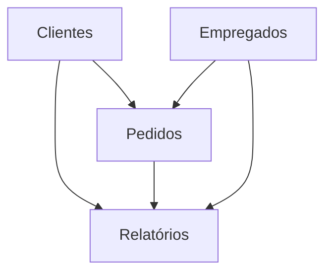

Para construir um projeto de data warehouse completo usando o PostgreSQL instanciado na AWS com foco no caso do Northwind Demo Database, vamos detalhar os seguintes passos:

1. **Configuração da Infraestrutura**:
   - **AWS**: Utilizaremos os serviços RDS para instanciar o PostgreSQL, S3 para armazenar arquivos e logs, e IAM para gerenciar permissões.
   - **Dbt-core**: Ferramenta para transformação de dados, que será configurada para se conectar ao PostgreSQL.
   - **[TODO] Terraform**: Para centralizar e gerenciar a infraestrutura cloud das nossas máquinas e servidores, facilidade para subir e desligar aplicações.

2. **Configuração do PostgreSQL na AWS**:
   - Criação de uma instância RDS PostgreSQL.
   - Configuração de parâmetros de segurança e rede (VPC, subnets, security groups).
   - Importação do banco de dados Northwind Demo para a instância PostgreSQL.

3. **Setup do Projeto dbt-core**:
   - Estrutura do projeto dbt-core.
   - Configuração de conexões no `profiles.yml`.
   - Criação de modelos para transformar dados e gerar relatórios.

4. **Criação dos Relatórios**:
   - Modelos dbt para cada relatório especificado.

### Configuração da Infraestrutura

#### 1. Configuração do PostgreSQL na AWS

- **Passo 1**: Criar uma instância RDS PostgreSQL.
  - Ir para o console da AWS RDS.
  - Selecionar "Create database" e escolher PostgreSQL.
  - Configurar detalhes como tipo de instância, armazenamento, VPC, subnets e security groups.

- **Passo 2**: Configurar parâmetros de segurança.
  - Configurar security groups para permitir acesso ao PostgreSQL somente de IPs confiáveis.
  - Configurar IAM roles e policies para acesso aos serviços necessários.

- **Passo 3**: Importar o Northwind Demo Database.
  - Baixar o script SQL do Northwind Demo Database.
  - Conectar ao PostgreSQL usando um cliente SQL (ex: pgAdmin, DBeaver) e executar o script para criar o banco de dados.

#### 2. Setup do Projeto dbt-core

- **Passo 1**: Instalar dbt-core.
  ```sh
  pip install dbt-core
  ```

- **Passo 2**: Criar um novo projeto dbt.
  ```sh
  dbt init northwind_project
  ```

- **Passo 3**: Configurar a conexão no `profiles.yml`.
  ```yaml
  northwind_project:
    outputs:
      dev:
        type: postgres
        host: your-aws-rds-endpoint
        user: your-username
        password: your-password
        dbname: northwind
        schema: public
        port: 5432
    target: dev
  ```

### Criação dos Relatórios

#### Modelos dbt

- **Modelo 1**: Relatório de todos os pedidos de 1996 e seus clientes.
  ```sql
  -- models/orders_1996.sql
  with orders_1996 as (
      select *
      from orders
      where extract(year from order_date) = 1996
  )
  select 
      o.*, 
      c.customer_name 
  from 
      orders_1996 o
  join 
      customers c on o.customer_id = c.customer_id
  ```

- **Modelo 2**: Número de empregados e clientes por cidade que tem empregados.
  ```sql
  -- models/employees_customers_by_employee_city.sql
  with employee_cities as (
      select city, count(*) as employee_count
      from employees
      group by city
  ),
  customer_cities as (
      select city, count(*) as customer_count
      from customers
      group by city
  )
  select 
      e.city, 
      e.employee_count, 
      coalesce(c.customer_count, 0) as customer_count
  from 
      employee_cities e
  left join 
      customer_cities c on e.city = c.city
  ```

- **Modelo 3**: Número de empregados e clientes por cidade que tem clientes.
  ```sql
  -- models/employees_customers_by_customer_city.sql
  with customer_cities as (
      select city, count(*) as customer_count
      from customers
      group by city
  ),
  employee_cities as (
      select city, count(*) as employee_count
      from employees
      group by city
  )
  select 
      c.city, 
      coalesce(e.employee_count, 0) as employee_count, 
      c.customer_count
  from 
      customer_cities c
  left join 
      employee_cities e on c.city = e.city
  ```

- **Modelo 4**: Número de empregados e clientes por cidade.
  ```sql
  -- models/employees_customers_by_city.sql
  with employee_cities as (
      select city, count(*) as employee_count
      from employees
      group by city
  ),
  customer_cities as (
      select city, count(*) as customer_count
      from customers
      group by city
  )
  select 
      coalesce(e.city, c.city) as city, 
      coalesce(e.employee_count, 0) as employee_count, 
      coalesce(c.customer_count, 0) as customer_count
  from 
      employee_cities e
  full outer join 
      customer_cities c on e.city = c.city
  ```

### Esquemas utilizando MermaidJS

#### Estrutura Geral



### Código em Python para rodar o projeto dbt-core

Crie um script `run_dbt.py` para executar os modelos dbt.

```python
import os

def run_dbt():
    os.system("dbt run")

if __name__ == "__main__":
    run_dbt()
```

### Conclusão

Esta estrutura cobre a configuração da infraestrutura necessária, a importação do banco de dados Northwind Demo para o PostgreSQL na AWS, a configuração do projeto dbt-core e os modelos necessários para gerar os relatórios especificados. O diagrama MermaidJS fornece uma visão geral das relações entre os principais componentes.